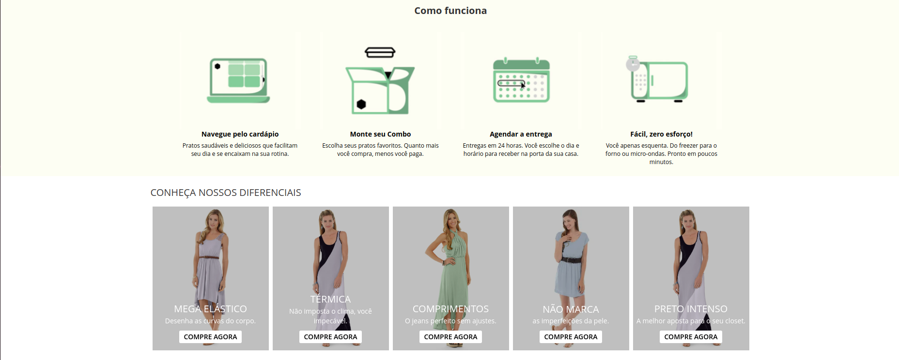

# desafio-hibrido
## Tarefa #3 - Nova Homepage- Híbrido

### Introdução da tarefa

Essa tarefa escolhida envolve a criação de várias seções na página inicial de um site Magento 2, incluindo um banner principal rotativo (full width), uma seção "Como Funciona", uma vitrine de produtos de uma categoria específica e uma grade de banners.

### Implementação das seções: 

1. Instalação do Magento 2: Utilizando o docker (Devilbox), optei por fazer uma instalação limpa do Magento 2 (versão: 2.4.6-p3). Foi feita a instalação do "Sample Data" que é um ambiente de teste no qual adiciona categorias,
produtos, regras de precificação, entre outros dados.  

2. Criação do Tema Personalizado:
Antes de começar a implementar as seções, a etapa inicial envolveu a criação de um tema personalizado para o site. Durante esse processo, foram definidos aspectos de design, layout e estilos que foram aplicados.

3. Criação do Módulo "Carousel":
Para implementar as funcionalidades dinâmicas dos carrosséis e banners, foi criado o módulo "Carousel". Blocos foram criados dentro do módulo, seguindo as diretrizes da tarefa que mencionavam a minimização do uso do CMS do Magento 2. Essa abordagem otimiza a organização e prepara o módulo para futuras funcionalidades no backend.
    Observação: Todos os blocos foram feitos por código, exceto a seção da vitrine de produtos. Optei por fazer esta em específico pelo Pagebuilder, pois esta funcionalidade já existe a listagem de produtos, o que falicita na hora do desenvolvimento. Aplicar por código envolveria parte de backend e mais tempo para realizar a trarefa. 

4. Uso do Slick Carousel:
Optei pelo uso do Slick Carousel devido à sua presença nativa no Magento 2 e à conveniência que isso oferece. Isso também está alinhado com a recomendação da tarefa de usar um carrossel de minha preferência.

5. Compilador Grunt (CSS): 
Para a compilação das estilizações dos arquivos .less, foi configurado o grunt e utilizado em todos os processos de estilização da tarefa. 

6. Traduções: 
Foram traduzidos todos os textos das seções da tarefa no arquivo de tradução i18n, acrescentando as tags devidas para cada arquivo. Também foi feita a instalação do módulo "rafaelstz/traducao_magento2_pt_br" para a tradução do Magento 2.

### Abaixo alguns prints do projeto:

Fico à disposição para esclarecimentos adicionais sobre o trabalho realizado e agradeço pela oportunidade!
